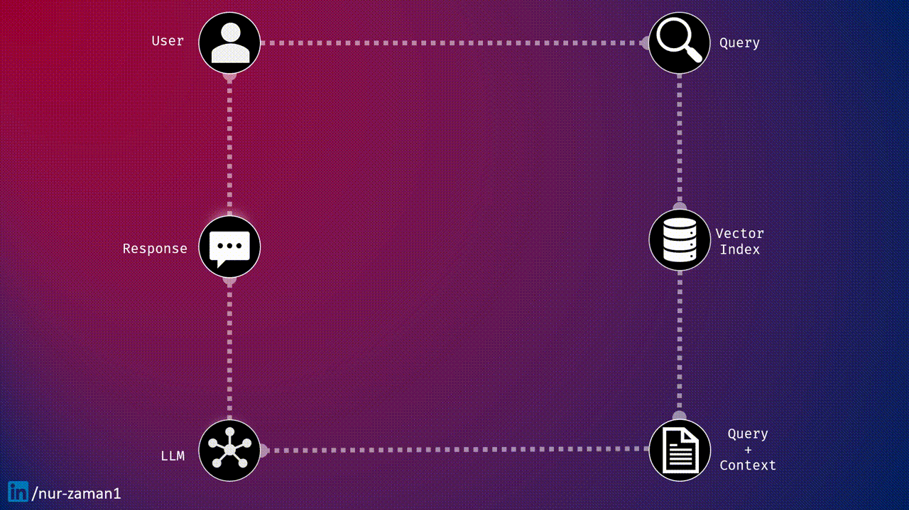
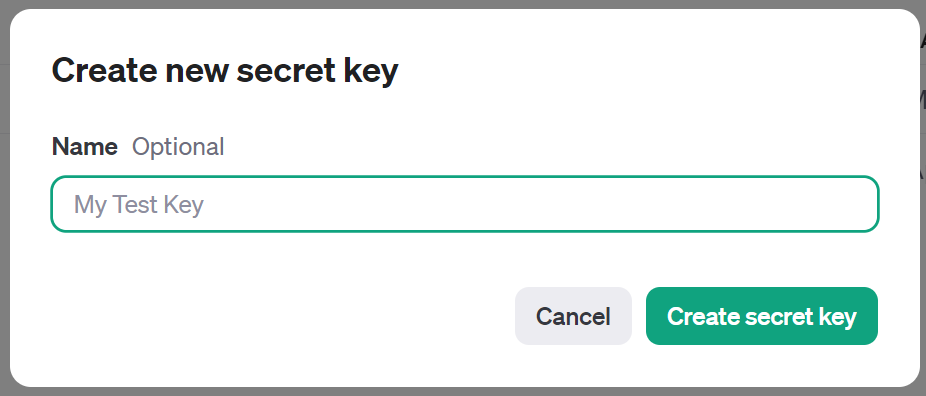
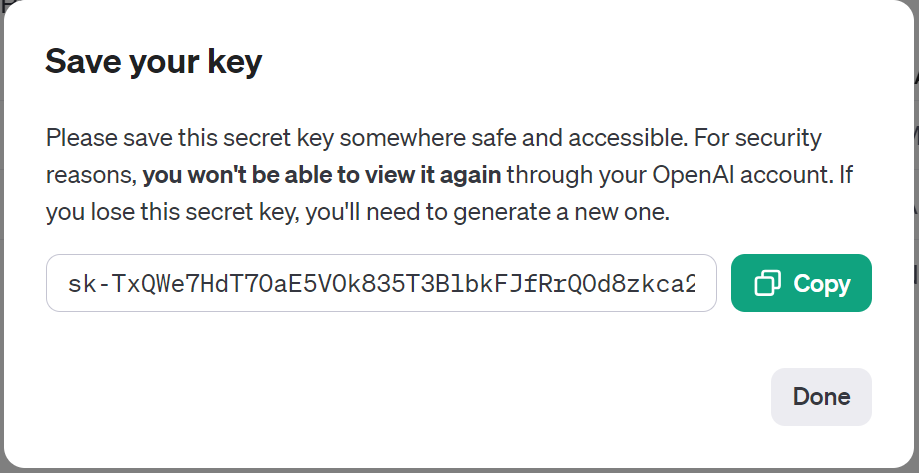
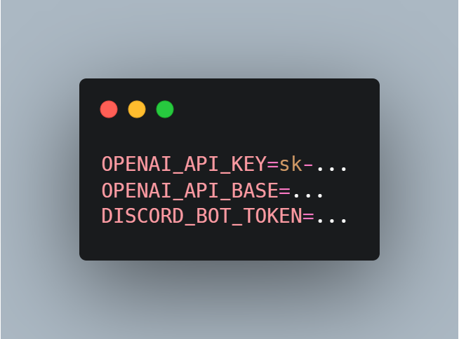
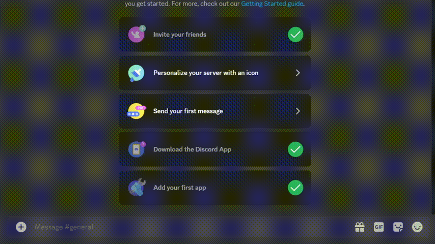

Retrieval-augmented generation (RAG) is a technique that enhances any LLM like ChatGPT with the ability to access your personal knowledge base as well as its own knowledge to produce better conversations or creations. For example, if you asked ChatGPT about a topic, it would not only use its reasoning skills and pre-trained data to answer, but also customize its response based on your personal data or knowledge base, giving you a more complete and accurate answer.


RAG works by transforming and embedding your personal data into vectors and storing them in a vector store. Then, before sending your query to the LLM, it retrieves the most relevant chunks of data from the vector store and adds them as context to your original query. This results in a more accurate response from the LLM.


Here is a simplified visualization,


<!--  -->

 


We will make a very minimal RAG application as a Discord Bot that can answer personalized queries.


 


We will use,


✅ Python 🐍<br>
✅ llamaIndex 🦙<br>
✅ interaction.py 🤖<br>
✅OpenAI API Key 🗝️<br>
🚫 ~~Short Attention Span~~ 😢


### Step 0: Prepare your data


The initial step is to gather personal documents and knowledge bases, clean it a bit and format it to any popular readable format like `.md`,`.txt`,`.pdf` etc.


For this example we will put this entire code base into the data folder!


### Step 1: Setting up the environment


- Install Python. I'm using version 3.10.1 So it's better to use 3.10.1 or greater.
- Grab you OpenAI API key from here, [https://platform.openai.com/account/api-keys](https://platform.openai.com/account/api-keys)








- Now we'll need our discord bot token. Go to https://discord.com/developers/applications . Create a new application and then go to the `Bot` section to grab your discord bot token.


- Put your tokens inside the `.env` file.





 


- run `pip install -r requirements.txt` to install the dependencies.
- invite the bot to your server.


 


Now let's start the actual coding part! 😤


### Step 2: Loading data and building the vector index


```python
#import necessary packages


from llama_index import SimpleDirectoryReader, VectorStoreIndex, load_index_from_storage
from llama_index.storage.storage_context import StorageContext


from dotenv import load_dotenv


import logging
import sys


```


 
Here we will be using [SimpleDirectoryReader](https://docs.llamaindex.ai/en/stable/module_guides/loading/simpledirectoryreader.html)  to read the files and [VectorStoreIndex](https://docs.llamaindex.ai/en/stable/module_guides/indexing/vector_store_index.html) to store the embeddings. Finally `load_index_from_storage` will be used to load saved indexes.


Next, set up the logger.


```python
#Load the environment variables and set up logger


load_dotenv()


logging.basicConfig(stream=sys.stdout, level=logging.INFO)
logging.getLogger().addHandler(logging.StreamHandler(stream=sys.stdout))


```


Let's write the function to build and load the index.


```python
async def load_index(directory_path : str = r'data'):
# Read the files
    documents = SimpleDirectoryReader(directory_path, filename_as_id=True).load_data()
    print(f"loaded documents with {len(documents)} pages")


    try:
        # Rebuild storage context
        storage_context = StorageContext.from_defaults(persist_dir="./storage")
        # Try to load the index from storage
        index = load_index_from_storage(storage_context)
        logging.info("Index loaded from storage.")


    except FileNotFoundError:
        logging.info("Index not found. Creating a new one...")
        index = VectorStoreIndex.from_documents(documents)
       
        # Persist index to disk
        index.storage_context.persist()
        logging.info("New index created and persisted to storage.")


    return index


```


Next let's write a function to update the Vector Store. In case we modify our documents.


```python


async def update_index(directory_path : str = r'data'):


    try:
        documents = SimpleDirectoryReader(directory_path, filename_as_id=True).load_data()
    except FileNotFoundError:
        logging.error("Invalid document directory path.")
        return None


    try:
        # Rebuild storage context
        storage_context = StorageContext.from_defaults(persist_dir="./storage")
        # Try to load the index from storage
        index = load_index_from_storage(storage_context)
        logging.info("Existing index loaded from storage.")
        refreshed_docs = index.refresh_ref_docs(documents, update_kwargs={"delete_kwargs": {"delete_from_docstore": True}})
        print('Number of newly inserted/refreshed docs: ', sum(refreshed_docs))
        index.storage_context.persist()
        logging.info("Index refreshed and persisted to storage.")
       
        return refreshed_docs
    except FileNotFoundError:
        logging.error("Index is not created yet.")


        return None


```


With that we completed the necessary function to build , load and update our database. We will put those functions in the `manage_embedding.py` file.


Next comes querying into this database,
```python
#querying.py
from manage_embedding import load_index
import logging
import sys


async def data_querying(input_text: str):
    # Load index
    index = await load_index("data")
    engine = index.as_query_engine()


    # queries the index with the input text
    response = engine.query(input_text)
    response_text = response.response
    logging.info(response_text)
    return response_text
```


This will fetch relevant information from the vector store we've created earlier. Then, append that to the query.
 
That's it! Congratulations 🎉 We have completed the core part of our discord bot's functionality.


### Step 3: Coding the bot
Let's code the final piece of this tutorial, we will set up a basic discord bot to interact with our rag application through discord. We will use [interactions.py](https://interactions-py.github.io/interactions.py/) as it provides an easy interface for slash commands.
we will create two slash commands,
⚔️ `/query` **input_text:** | will allow us to query into the database.
⚔️ `/updatedb` | will check for update in the data folder and rebuild out database
```python
# bot.py
from interactions import Client, Intents, slash_command, SlashContext, listen,slash_option,OptionType
from dotenv import load_dotenv
import os


from querying import data_querying
from manage_embedding import update_index


load_dotenv()


bot = Client(intents=Intents.ALL)


@listen()
async def on_ready():
    print("Ready")


@slash_command(name="query", description="Enter your query :)")
@slash_option(
    name="input_text",
    description="input text",
    required=True,
    opt_type=OptionType.STRING,
)


async def get_response(ctx: SlashContext, input_text: str):
    await ctx.defer()
    response = await data_querying(input_text)
    response = f'**Input Query**: {input_text}\n\n{response}'
    await ctx.send(response)


@slash_command(name="updatedb", description="Update your information database :)")
async def updated_database(ctx: SlashContext):
    await ctx.defer()
    update = await update_index()
    if update:
        response = f'Updated {sum(update)} document chunks'
    else:
        response = f'Error updating index'
    await ctx.send(response)


bot.start(os.getenv("DISCORD_BOT_TOKEN"))
```


DONE!! 😎


### Step 4: Running the bot


Just run the bot with `python bot.py` and it's ready to take our queries



<!--  -->


### Github Repo




