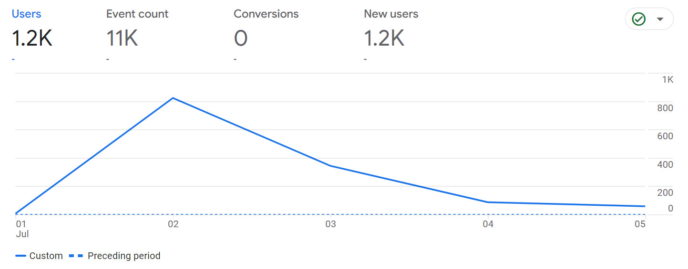

**A BRAC University Classroom Availability Checker**

[This](https//nur-zaman.github.io/isTheClassroomEmpty/) web application allows BRAC University students to check the availability of classrooms in real-time. This helps them plan their schedule efficiently and avoid wasting time searching for empty classrooms. Which helped a large number of student for two semesters.



## How it works

The application utilizes a combination of technologies to achieve its functionality

###  Web Scraping 
The application periodically scrapes BRAC University's official website to retrieve the latest classroom occupancy data. This data includes the classroom number, its location, and its current occupancy status (e.g., empty, occupied, reserved).
###  Data Processing 
The scraped data is then processed and cleaned to ensure its accuracy and integrity. This includes removing irrelevant information and formatting the data for easier presentation on the web interface.
###  Real-time Updates 
The application updates the classroom occupancy information in real-time, providing users with the most current data available.
###  Web Interface 
The application features a user-friendly web interface that allows users to easily search for specific classrooms and view their current occupancy status. The interface also provides additional information, such as the classroom location and capacity.

## Technical Stack

### Front-end
    - HTML 
    - TailwindCSS
    - JavaScript 
###  Back-end 
    - Python (web scraping)

## Usage

1. Visit the application website [https//nur-zaman.github.io/isTheClassroomEmpty/](https//nur-zaman.github.io/isTheClassroomEmpty/)
2. Enter the classroom number you want to check.
3. The application will display the current occupancy status of the classroom.
4. You can also browse the list of classrooms to see their availability.

## Additional Features

 Users can filter their search by building or floor.
 The application is mobile-friendly and can be accessed from any device.

## Disclaimer

This application is not officially affiliated with BRAC University. While it strives to provide accurate information, it is recommended to double-check with the university's official sources for any critical decisions.
